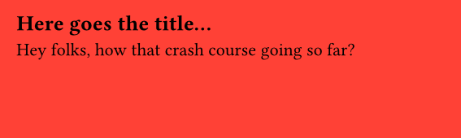

!!! note

    The official Typst documentation website has [its own tutorial](https://typst.app/docs/tutorial/), that goes in **much more depth** that the crash course you're actually reading. Here, we'll focus on giving you the **big picture** rather than technical details.

<br>

## Typst = text + a compiler

What we call "Typst" is usually one of the following:

- the Typst **company** :octicons-arrow-right-24: the legal organization and people developing Typst
- the Typst **typesetting system** :octicons-arrow-right-24: the language in itself
- the Typst **compiler** :octicons-arrow-right-24: the (CLI) program that actually creates the PDF

The compiler will take a `.typ` file and create a [PDF file][example] with it. For example, a Typst file might look like this:

```typst
#set page(fill: red, width: 10cm, height: 3cm)

== Here goes the title...

Hey folks, how that crash course going so far?
```

Then we run `typst compile file.typ`, and we get:



## Typst, in practice

When you're trying to use Typst in more complex environments, like a production environment, you're often interested in how-to-use the Typst compiler.

The thing is, the compiler is a CLI (Command Line Interface), which means it needs to run from the terminal, and often you'll want to be able to call Typst from a programming language.

## Basic syntax

```typst
#set text(blue, size: 14pt)
```

[example]: https://typst.app/docs/reference/html/ "Note that you can also generate other files such as HTML"
