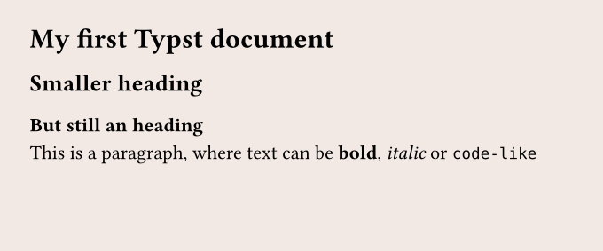
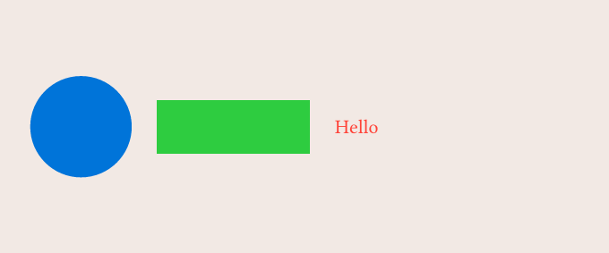

!!! note

    The official Typst documentation website has [its own tutorial](https://typst.app/docs/tutorial/), that goes in **much more depth** that the crash course you're actually reading. Here, we'll focus on giving you the **big picture** rather than technical details.

<br>

## Typst = text + a compiler

What we call "Typst" is usually one of the following:

- the Typst **company** :octicons-arrow-right-24: the legal organization and people developing Typst
- the Typst **typesetting system** :octicons-arrow-right-24: the language in itself
- the Typst **compiler** :octicons-arrow-right-24: the (CLI) program that actually creates the PDF

The compiler will take a `.typ` file and create a [PDF file][example] with it. For example, a Typst file might look like this:

```typst
#set page(fill: red, width: 10cm, height: 3cm)

== Here goes the title...

Hey folks, how that crash course going so far?
```

Then we run `typst compile file.typ`, and we get:


[example]: https://typst.app/docs/reference/html/ "Note that you can also generate other files such as HTML"

## Typst, in practice

The compiler is a CLI (Command Line Interface), which means it needs to run from the terminal.

But when you're trying to use Typst in more complex environments, like a ^^web server^^ or ^^data pipeline^^, you're often interested in generating a PDF from a programming language, not from the terminal.

## Basic syntax

If you ever used markdown before, getting started with Typst will be easy. For example, the following Typst file:

```typst
#set page(fill: rgb("#f2e9e4"), width: 12cm, height: 5cm)

= My first Typst document

== Smaller heading

=== But still an heading

This is a paragraph, where text can be *bold*, _italic_ or `code-like`
```



## Functions

Typst offers tons of functions that we can use to customize the output of our PDF. The syntax is very simple, and often, very intuitive.

For example, I want to put a blue circle, next to a green rectangle, next to a red text. How can I do that?

```typst
#set page(fill: rgb("#f2e9e4"), width: 12cm, height: 5cm)

#stack(
  dir: ltr, // direction --> left to right
  spacing: 0.5cm, // space between elements
  circle(fill: blue, width: 2cm),
  rect(fill: green, width: 3cm),
  text(fill: red, "Hello")
)
```


What if I want them to be vertically aligned? I just call the `align()` function:

```typst
#set page(fill: rgb("#f2e9e4"), width: 12cm, height: 5cm)

#align(horizon, stack(
  dir: ltr,
  spacing: 0.5cm,
  circle(fill: blue, width: 2cm),
  rect(fill: green, width: 3cm),
  text(fill: red, "Hello"),
))
```



## Set rules

A set rule is a way to tell to Typst how a given function should behave. For example, by default the `text()` function uses `fill: black` for its color, but if we do:

```typst
#set text(fill: blue)
```

Then **all** text will now be blue. You might realize that this is what we used in the examples before with:

```typst
#set page(width: 12cm, height: 5cm)
```

This says that the `page()` function (what is used to create every page under the hood!) has a 12cm width and a 5cm height.
