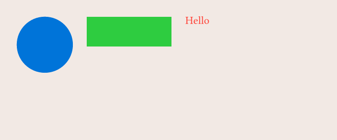
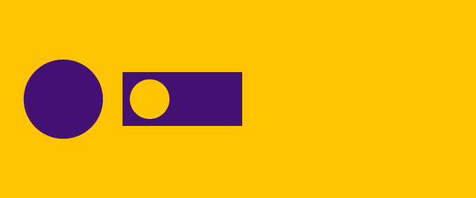
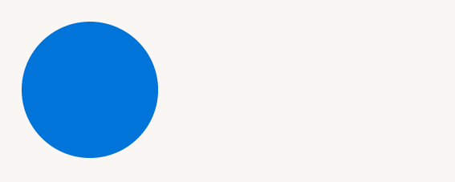
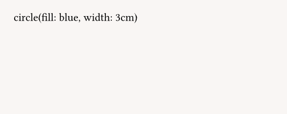
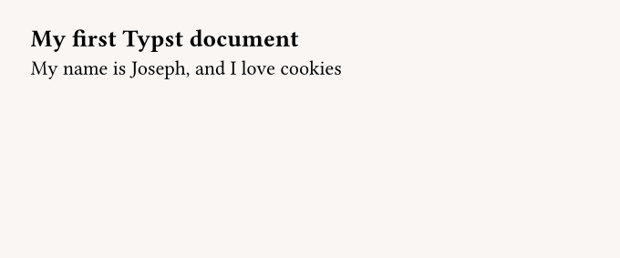
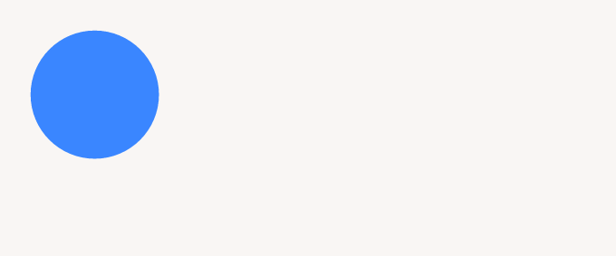
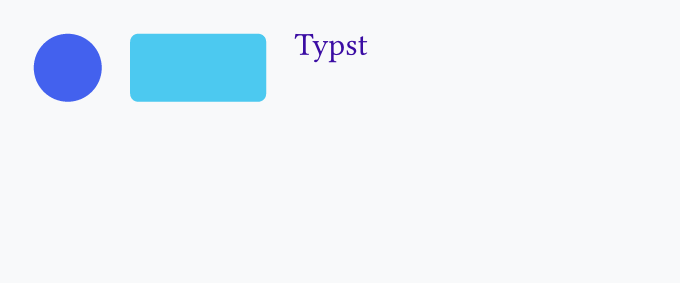
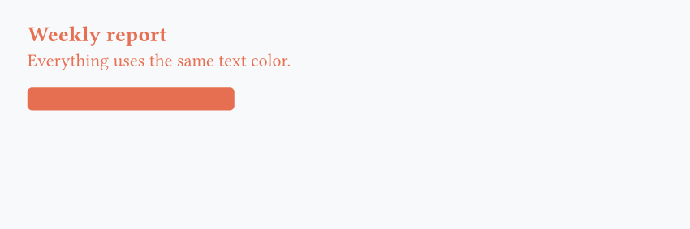
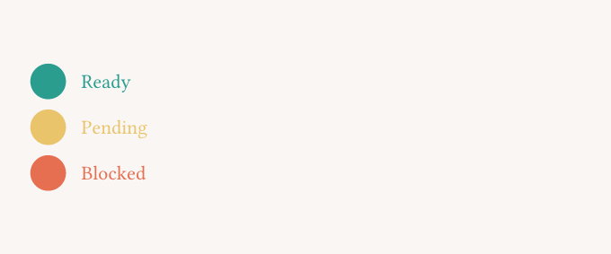
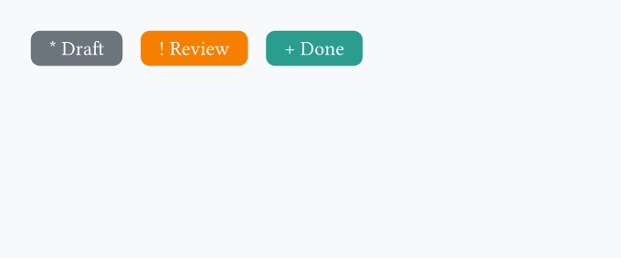

!!! note

    The official Typst documentation website has [its own tutorial](https://typst.app/docs/tutorial/), that goes in **much more depth** that the crash course you're actually reading. Here, we'll focus on giving you the **big picture** rather than technical details.

<br>

## Typst = text + a compiler

What we call "Typst" is usually one of the following:

- the Typst **company** :octicons-arrow-right-24: the legal organization and people developing Typst
- the Typst **typesetting system** :octicons-arrow-right-24: the language in itself
- the Typst **compiler** :octicons-arrow-right-24: the (CLI) program that actually creates the PDF

The compiler will take a `.typ` file and create a [PDF file][footnote-1] with it. For example, a Typst file might look like this:

```typst title="file.typ"
#set page(fill: red, width: 10cm, height: 3cm)

== Here goes the title...

Hey folks, how that crash course going so far?
```

Then we run `typst compile file.typ`, and we get:


[footnote-1]: https://typst.app/docs/reference/html/ "Note that you can also generate other files such as HTML"

## Typst, in practice

The compiler is a CLI (Command Line Interface), which means it needs to run from the terminal.

But when you're trying to use Typst in more complex environments, like a ^^web server^^ or ^^data pipeline^^, you're often interested in generating a PDF from a programming language, not from the terminal.

## Basic syntax

If you ever used markdown before, getting started with Typst will be easy. For example, the following Typst file:

```typst
#set page(fill: rgb("#f2e9e4"), width: 12cm, height: 5cm)

= My first Typst document

== Smaller heading

=== But still an heading

This is a paragraph, where text can be *bold*, _italic_ or `code-like`
```


## Functions

Typst offers tons of functions that we can use to customize the output of our PDF. The syntax is very simple, and often, very intuitive.

For example, I want to put a blue circle, next to a green rectangle, next to a red text. How can I do that?

```typst
#set page(fill: rgb("#f2e9e4"), width: 12cm, height: 5cm)

#stack(
  dir: ltr, // direction --> left to right
  spacing: 0.5cm, // space between elements
  circle(fill: blue, width: 2cm),
  rect(fill: green, width: 3cm),
  text(fill: red, "Hello")
)
```



What if I want them to be vertically aligned? I just call the `align()` function:

```typst
#set page(fill: rgb("#f2e9e4"), width: 12cm, height: 5cm)

#align(horizon, stack(
  dir: ltr,
  spacing: 0.5cm,
  circle(fill: blue, width: 2cm),
  rect(fill: green, width: 3cm),
  text(fill: red, "Hello"),
))
```


## Set rules

A set rule is a way to tell to Typst how a given function should behave. For example, by default the `text()` function uses `fill: black` for its color, but if we do:

```typst
#set text(fill: blue)
```

Then **all** text will now be blue. You might realize that this is what we used in the examples before with:

```typst
#set page(width: 12cm, height: 5cm)
```

This says that the `page()` function (what is used to create every page under the hood!) has a 12cm width and a 5cm height.

## Variables

We can define variables, like in any programming language, in order to reuse them thanks to the `let` keyword. A common use case is to define branding colors:

```typst
#let yellow = rgb("#FFC300")
#let purple = rgb("#421173")

#set page(fill: yellow, width: 12cm, height: 5cm)

#align(horizon, stack(
  dir: ltr,
  spacing: 0.5cm,
  circle(fill: purple, width: 2cm),
  rect(fill: purple, width: 3cm, circle(fill: yellow, width: 1cm)),
))
```



## Create your own functions

Even though Typst is a markup language (!= programming language), it embeds a scripting language that let us add **logic** (`if`/`else` statements, `for` loops, etc) and create reusable components.

Let's look at an example:

```typst
#set page(fill: aqua, width: 12cm, height: 5cm)

#let say-hello(s)= {
  // s is the argument name
  [Hello my friend #s, how are you?]
}

#say-hello("Joseph")

#say-hello("Justine")
```


Once again we use the `let` keyword, and then we wrap the output of the function inside curly braces.

## When or when not to use the `#` symbol

A thing that might be confusing in the previous code snippets is that sometimes we use the `#` symbol, and sometimes we don't.

=== "With the `#`"

    ```typst
    #circle(fill: blue, width: 3cm)
    ```

    

=== "Without the `#`"

    ```typst
    circle(fill: blue, width: 3cm)
    ```

    

In the first case, the output is just a simple circle, while in the second case, it's the actual text instead of a circle. Why is that?

It's because Typst has [2 modes][footnote-2]:

[footnote-2]: https://typst.app/docs/reference/syntax/ "There are actually 3 modes, where the 3rd one is the math mode, but it's not discussed here."

- Markup mode
- Code mode

By default we're in Markup mode, and we need to add the `#` before a function name, a set rule or when defining a new variable. But we switch to code mode in many cases:

=== "Inside function definition"

    ```typst
    #let yellow-circle() = {
      let yellow = rgb("#FFC300")      // no `#` here
      circle(fill: yellow, width: 3cm) // no `#` here
    }
    ```

=== "Inside function calling (e.g., arguments)"

    ```typst
    #circle(
      width: 3cm,
      circle(fill: blue, width: 1cm) // no `#` here
    )
    ```

Those are just common examples, but in practice you'll quickly find this intuitive as you start using Typst. A great way to make this simpler to you is to make you have ^^syntax highlighting^^ in your editor. If you have a second look [here](#when-or-when-not-to-use-the--symbol), you'll see that in the second case the text is all black, meaning that it will be rendered as is.

<br><br>

## Exercises

!!! note

    - Make sure to either [install Typst](https://typst.app/open-source/) or use their [Web app](https://typst.app/play/)
    - Always include `#set page(fill: rgb("#f9f6f4"), width: 12cm, height: 5cm)` at the top of the document to:
        - ensure a fixed page size, because by default it will be A4, which is more than necessary
        - have a distinct background (light grey)

#### 1 - Basics

Reproduce the PDF below:

=== "Exercise"

    

=== "Hint"

    - Headings are made using the `=` symbol
    - Paragraph can be written directly, like in markdown

=== "Solution"

    ```typst
    #set page(fill: rgb("#f9f6f4"), width: 12cm, height: 5cm)

    == My first Typst document

    My name is Joseph, and I love cookies
    ```

#### 2 - A first shape

Reproduce the PDF below:

=== "Exercise"

    

=== "Hint"

    - Call the `circle()` function with a `#`
    - Use `fill` and `width` arguments

=== "Solution"

    ```typst
    #set page(fill: rgb("#f9f6f4"), width: 12cm, height: 5cm)

    #circle(fill: rgb("#3a86ff"), width: 2.5cm)
    ```

#### 3 - Layout with `stack`

Reproduce the PDF below:

=== "Exercise"

    

=== "Hint"

    - Use `stack()` with `dir: ltr`
    - Add `spacing` between elements
    - Put a `circle()`, a `rect()`, and a `text()` inside
    - Look at the `radius` argument in `stack()` and the `size` argument in `text()`

=== "Solution"

    ```typst
    #set page(fill: rgb("#f9f6f4"), width: 12cm, height: 5cm)

    #stack(
      dir: ltr,
      spacing: 0.5cm,
      circle(fill: rgb("#4361ee"), width: 1.2cm),
      rect(fill: rgb("#4cc9f0"), width: 2.4cm, height: 1.2cm, radius: 4pt),
      text(fill: rgb("#3a0ca3"), size: 16pt, "Typst"),
    )
    ```

#### 4 - Variables and set rules

Reproduce the PDF below:

=== "Exercise"

    

=== "Hint"

    - Define the main color (#e76f51) with `#let`
    - Use `#set text(...)` to style all text at once

=== "Solution"

    ```typst
    #let main-color = rgb("#e76f51")

    #set page(fill: rgb("#f9f6f4"), width: 12cm, height: 5cm)
    #set text(fill: main-color)

    == Weekly report

    Everything uses the same text color.

    #rect(fill: main-color, width: 4.5cm, height: 0.5cm, radius: 3pt)
    ```

#### 5 - Combining `align` and `stack`

Reproduce the PDF below:

=== "Exercise"

    

=== "Hint"

    - Wrap your content in `align(horizon, ...)`
    - Build one vertical stack and small horizontal stacks inside it
    - Reuse the same pattern for 3 status lines

=== "Solution"

    ```typst
    #set page(fill: rgb("#f9f6f4"), width: 12cm, height: 5cm)

    #align(horizon, stack(
      spacing: 0.2cm,
      stack(
        dir: ltr,
        spacing: 0.3cm,
        circle(fill: rgb("#2a9d8f"), width: 0.7cm),
        text(fill: rgb("#2a9d8f"), "Ready"),
      ),
      stack(
        dir: ltr,
        spacing: 0.3cm,
        circle(fill: rgb("#e9c46a"), width: 0.7cm),
        text(fill: rgb("#e9c46a"), "Pending"),
      ),
      stack(
        dir: ltr,
        spacing: 0.3cm,
        circle(fill: rgb("#e76f51"), width: 0.7cm),
        text(fill: rgb("#e76f51"), "Blocked"),
      ),
    ))
    ```

#### 6 - Create a function with parameters

Reproduce the PDF below:

=== "Exercise"

    

=== "Hint"

    - Define `badge(...)` with `#let`
    - Give it at least 2 parameters (`label`, `color`)
    - Add one optional parameter with a default value
    - Call the function multiple times with different arguments

=== "Solution"

    ```typst
    #set page(fill: rgb("#f9f6f4"), width: 12cm, height: 5cm)

    #let badge(label, color, icon: "*") = {
      rect(
        fill: color,
        radius: 5pt,
        inset: (x: 10pt, y: 6pt),
        text(fill: white, [#icon #label]),
      )
    }

    #stack(
      dir: ltr,
      spacing: 0.35cm,
      badge("Draft", rgb("#6c757d")),
      badge("Review", rgb("#f77f00"), icon: "!"),
      badge("Done", rgb("#2a9d8f"), icon: "+"),
    )
    ```

<br><br>

## Next step

You now have some good Typst foundations! If you want to learn more, you can have a look at this _unofficial_ [Typst Examples Book](https://sitandr.github.io/typst-examples-book/book/about.html).

Otherwise you're ready to start using Typst from a programming language!
