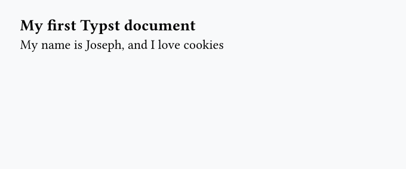
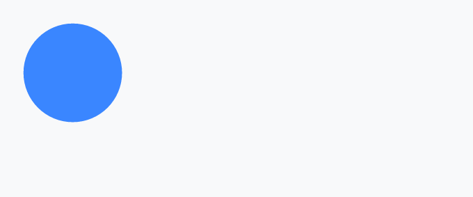
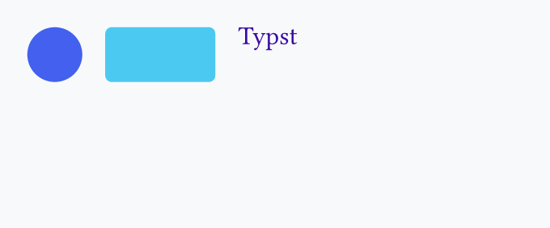

## Exercises

!!! note

    - Make sure to either [install Typst](https://typst.app/open-source/) or use their [web app](https://typst.app/play/)
    - Feel free to use the [official documentation](https://typst.app/docs/).
    - Always include `#set page(fill: rgb("#f8f9fa"), width: 12cm, height: 5cm)` at the top of the document to:
        - ensure a fixed page size, because by default it will be A4, which is more than necessary
        - have a distinct background (light grey)

### 1 - Basics

Reproduce the PDF below:

=== "Exercise"

    

=== "Hint"

    - Headings are made using the `=` symbol
    - Paragraphs can be written directly, like in Markdown

=== "Solution"

    ```typst
    #set page(fill: rgb("#f8f9fa"), width: 12cm, height: 5cm)

    == My first Typst document

    My name is Joseph, and I love cookies
    ```

### 2 - A first shape

Reproduce the PDF below:

=== "Exercise"

    

=== "Hint"

    - Call the `circle()` function with a `#`
    - Use `fill` and `width` arguments

=== "Solution"

    ```typst
    #set page(fill: rgb("#f8f9fa"), width: 12cm, height: 5cm)

    #circle(fill: rgb("#3a86ff"), width: 2.5cm)
    ```

### 3 - Layout with `stack`

Reproduce the PDF below:

=== "Exercise"

    

=== "Hint"

    - Use `stack()` with `dir: ltr`
    - Add `spacing` between elements
    - Put a `circle()`, a `rect()`, and a `text()` inside
    - Look at the `radius` argument in `stack()` and the `size` argument in `text()`

=== "Solution"

    ```typst
    #set page(fill: rgb("#f8f9fa"), width: 12cm, height: 5cm)

    #stack(
      dir: ltr,
      spacing: 0.5cm,
      circle(fill: rgb("#4361ee"), width: 1.2cm),
      rect(fill: rgb("#4cc9f0"), width: 2.4cm, height: 1.2cm, radius: 4pt),
      text(fill: rgb("#3a0ca3"), size: 16pt, "Typst"),
    )
    ```

### 4 - Variables and set rules

Reproduce the PDF below:

=== "Exercise"

    

=== "Hint"

    - Define the main color (#e76f51) with `#let`
    - Use `#set text(...)` to style all text at once

=== "Solution"

    ```typst
    #let main-color = rgb("#e76f51")

    #set page(fill: rgb("#f8f9fa"), width: 12cm, height: 5cm)
    #set text(fill: main-color)

    == Weekly report

    Everything uses the same text color.

    #rect(fill: main-color, width: 4.5cm, height: 0.5cm, radius: 3pt)
    ```
