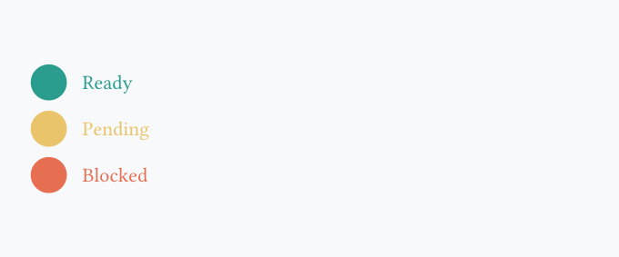
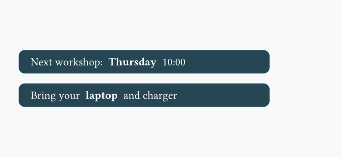
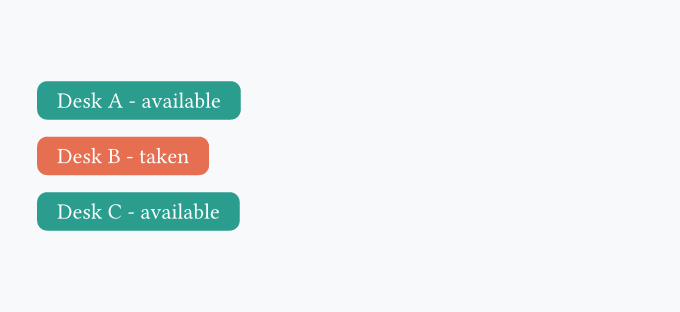
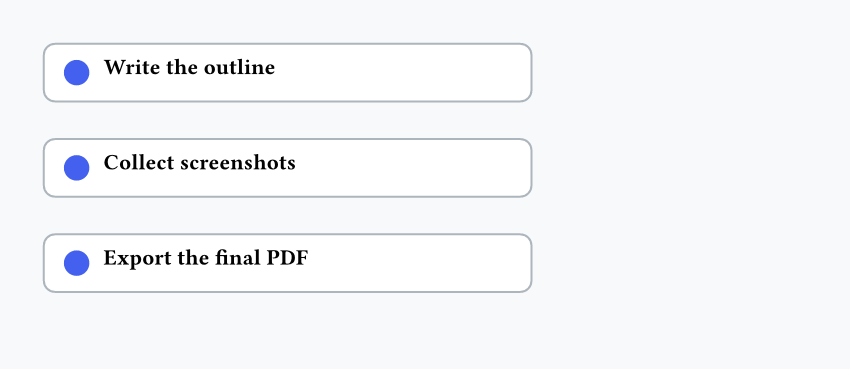

In the following exercises, you'll need to reproduce in Typst the image you see. You can freely use the [official Typst documentation](https://typst.app/docs/).

### 1 - Combining `align` and `stack`

=== "Exercise"

    

=== "Hint"

    - Wrap your content in `align(horizon, ...)`
    - Build one vertical stack and small horizontal stacks inside it

=== "Solution"

    ```typst
    #align(horizon, stack(
      spacing: 0.2cm,
      stack(
        dir: ltr,
        spacing: 0.3cm,
        circle(fill: rgb("#2a9d8f"), width: 0.7cm),
        text(fill: rgb("#2a9d8f"), "Ready"),
      ),
      stack(
        dir: ltr,
        spacing: 0.3cm,
        circle(fill: rgb("#e9c46a"), width: 0.7cm),
        text(fill: rgb("#e9c46a"), "Pending"),
      ),
      stack(
        dir: ltr,
        spacing: 0.3cm,
        circle(fill: rgb("#e76f51"), width: 0.7cm),
        text(fill: rgb("#e76f51"), "Blocked"),
      ),
    ))
    ```

### 2 - Create a function with parameters

=== "Exercise"

    

=== "Hint"

    - Define `badge(...)` with `#let`
    - Give it 2 required parameters (`label`, `color`)
    - Add one optional parameter with a default value for the symbol before the label
    - Call the function multiple times inside a `stack()`

=== "Solution"

    ```typst
    #let badge(label, color, icon: "*") = {
      rect(
        fill: color,
        radius: 5pt,
        inset: (x: 10pt, y: 6pt),
        text(fill: white, [#icon #label]),
      )
    }

    #stack(
      dir: ltr,
      spacing: 0.35cm,
      badge("Draft", rgb("#6c757d")),
      badge("Review", rgb("#f77f00"), icon: "!"),
      badge("Done", rgb("#2a9d8f"), icon: "+"),
    )
    ```

### 3 - Variadic announcement bars

=== "Exercise"

    

=== "Hint"

    - Define a function with a variadic parameter like `..parts`
    - Put these parts inside a `stack(dir: ltr, ...)`

=== "Solution"

    ```typst
    #let notice(..parts) = {
      rect(fill: rgb("#264653"), radius: 6pt, inset: (x: 12pt, y: 8pt), stack(
        dir: ttb,
        spacing: 0.2cm,
        text(weight: "bold", size: 11pt)[Important info:],
        ..parts,
      ))
    }

    #align(horizon, stack(
      dir: ltr,
      spacing: 0.35cm,
      notice("$10 to enter", "Children welcomed"),
      notice("Free drinks", "Starts at 8:00", "Children allowed"),
      notice(rect(fill: red, radius: 30%, "Event canceled")),
    ))
    ```

### 4 - Conditional status labels

=== "Exercise"

    

=== "Hint"

    - Define a function with one label argument and one boolean argument
    - Use `if`/`else` to change both the color and the text
    - Give the boolean argument a default value so you can omit it sometimes

=== "Solution"

    ```typst
    #let desk-status(label, free: true) = {
      let s = if free { [#label - available] } else { [#label - taken] }
      let c = if free { rgb("#2a9d8f") } else { rgb("#e76f51") }
      rect(
        fill: c,
        radius: 5pt,
        inset: (x: 10pt, y: 6pt),
        text(fill: white, s)
      )
    }

    #align(horizon, stack(
      spacing: 0.3cm,
      desk-status("Desk A"),
      desk-status("Desk B", free: false),
      desk-status("Desk C"),
    ))
    ```

### 5 - Generate a checklist with a loop

=== "Exercise"

    

=== "Hint"

    - Create a function that accepts a task name
    - Use a `for` loop to repeat the same card layout for each item
    - Add a small `v(...)` spacer after each generated card

=== "Solution"

    ```typst
    #let todo(s) = {
      rect(
        fill: white,
        stroke: rgb("#adb5bd"),
        radius: 6pt,
        inset: (x: 10pt, y: 8pt),
        width: 8.6cm,
        stack(
          dir: ltr,
          spacing: 0.25cm,
          circle(fill: rgb("#4361ee"), width: 0.45cm),
          text(weight: "bold", s),
        ),
      )
      v(0.2cm)
    }

    #let items = ("Write the outline", "Collect screenshots", "Export the final PDF")
    #for item in items {
      todo(item)
    }
    ```

<br>
<br>

!!! Question

    Having questions? Feedback? [Feel free to ask](https://github.com/y-sunflower/typst-in-production/issues)!
