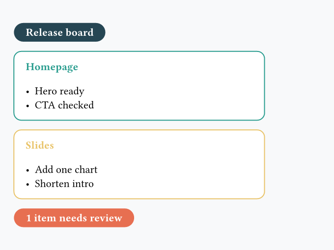

In the following exercises, you'll need to reproduce in Typst the image you see. You can freely use the [official Typst documentation](https://typst.app/docs/).

!!! info

    In the following exercises, **there isn't just one way of doing things**! The best way is often the simplest: it minimizes code duplication and makes code reusable and easy to maintain.

### 1 - Build a small release board

=== "Exercise"

    

=== "Hint"

    - Split the work into small reusable functions instead of writing one large block
    - Use another function with `..notes`, then loop over these notes to build each card

=== "Solution"

    ```typst
    #set page(fill: rgb("#f8f9fa"), width: 15cm, height: 10cm, margin: 0.5cm)

    #let banner(label, fill) = {
      rect(
        fill: fill,
        radius: 999pt,
        inset: (x: 12pt, y: 6pt),
        text(weight: "bold", fill: white, label),
      )
    }

    #let note-list(..notes) = {
      for note in notes.pos() {
        [- #note \ ]
      }
    }

    #let task-card(title, color, ..notes) = {
      rect(fill: white, stroke: color, radius: 8pt, inset: 12pt, width: 9cm, [
        #text(weight: "bold", fill: color, title)
        #v(0.15cm)
        #note-list(..notes)
      ])
    }

    #banner("Release board", rgb("#264653"))
    #task-card(
      "Homepage",
      rgb("#2a9d8f"),
      "Hero ready",
      "CTA checked",
      "Something else goes here",
    )
    #task-card("Slides", rgb("#e9c46a"), "Add one chart", "Shorten intro")
    #banner("1 item needs review", rgb("#e76f51"))
    ```
