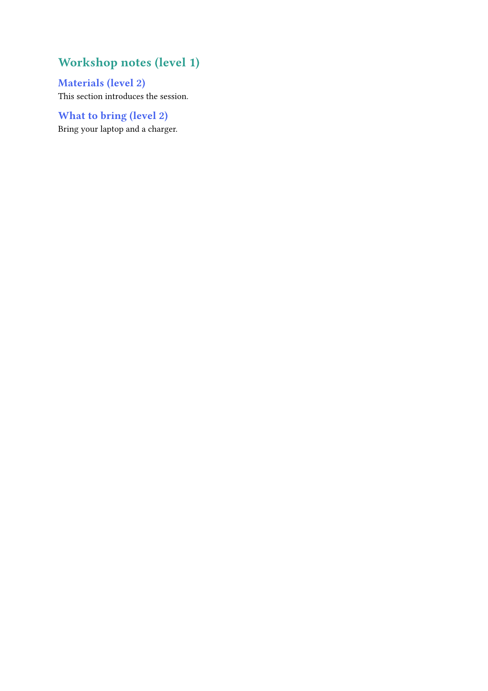
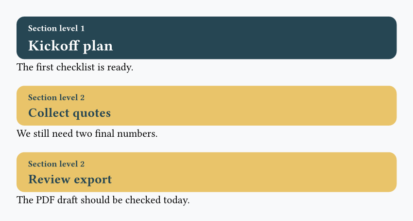

In the following exercises, you'll need to reproduce in Typst the image you see. You can freely use the [official Typst documentation](https://typst.app/docs/).

!!! info

    In the following exercises, **there isn't just one way of doing things**! The best way is often the simplest: it minimizes code duplication and makes code reusable and easy to maintain.

### 1 - Build a small release board

=== "Exercise"

    

=== "Hint"

    - Split the work into small reusable functions instead of writing one large block
    - Use another function with `..notes`, then loop over these notes to build each card

=== "Solution"

    ```typst
    #set page(fill: rgb("#f8f9fa"), width: 15cm, height: 10cm, margin: 0.5cm)

    #let banner(label, fill) = {
      rect(
        fill: fill,
        radius: 999pt,
        inset: (x: 12pt, y: 6pt),
        text(weight: "bold", fill: white, label),
      )
    }

    #let note-list(..notes) = {
      for note in notes.pos() {
        [- #note \ ]
      }
    }

    #let task-card(title, color, ..notes) = {
      rect(fill: white, stroke: color, radius: 8pt, inset: 12pt, width: 9cm, [
        #text(weight: "bold", fill: color, title)
        #v(0.15cm)
        #note-list(..notes)
      ])
    }

    #banner("Release board", rgb("#264653"))
    #task-card(
      "Homepage",
      rgb("#2a9d8f"),
      "Hero ready",
      "CTA checked",
      "Add final screenshot",
    )
    #task-card("Slides", rgb("#e9c46a"), "Add one chart", "Shorten intro")
    #banner("1 item needs review", rgb("#e76f51"))
    ```

### 2 - Color headings with `show`

=== "Exercise"

    

=== "Hint"

    - Use `#show heading.where(level: 1): ...`
    - Then add another show rule for `level: 2`
    - Inside each show rule, apply a `set text(...)`

=== "Solution"

    ```typst
    #show heading.where(level: 1): set text(fill: rgb("#2a9d8f"))
    #show heading.where(level: 2): set text(fill: rgb("#4361ee"))

    = Workshop notes (level 1)
    == Materials (level 2)
    This section introduces the session.

    == What to bring (level 2)
    Bring your laptop and a charger.
    ```

### 3 - Turn headings into section cards

=== "Exercise"

    

=== "Hint"

    - Write a `#show heading: it => ...` rule
    - Use `it.body` and `it.level`
    - Use an `if`/`else` to change the card colors depending on the heading level
    - Wrap each transformed heading in a full-width rounded `rect(...)`
    - **Tip**: use `#lorem(15)` to generate 15 random Lorem Ipsum words.

=== "Solution"

    ```typst
    #set page(fill: rgb("#f8f9fa"), width: 15cm, height: 13cm)

    #show heading: it => {
    let fill = if it.level == 1 { rgb("#264653") } else { rgb("#e9c46a") }
    let ink = if it.level == 1 { white } else { rgb("#264653") }
    let line-fill = if it.level == 1 { white } else { rgb("#264653") }
    let heading-size = if it.level == 1 { 14pt } else { 12pt }

        rect(fill: fill, radius: 8pt, inset: (x: 8pt, y: 10pt), width: 100%, [
          #underline(text(size: 9pt, fill: ink)[Section level #it.level], offset: 2pt)\
          #text(size: heading-size, weight: "bold", fill: ink)[#it.body]
        ])

    }

    = Kickoff plan
    #lorem(15)

    == Collect quotes
    #lorem(15)

    == Review export
    #lorem(15)
    ```

<br>
<br>

!!! Question

    Having questions? Feedback? [Feel free to ask](https://github.com/y-sunflower/typst-in-production/issues)!
