## Typst = text + a compiler

Typst is a **compiler** :octicons-arrow-right-24: a (CLI) program that creates PDFs.

The compiler will take a `.typ` file and create a [PDF file][footnote-1] with it. For example, a Typst file might look like this:

```typst title="file.typ"
#set page(fill: red, width: 10cm, height: 3cm)

== Here goes the title...

Hey folks, how's that crash course going so far?
```

Then we run `typst compile file.typ`, and we get:

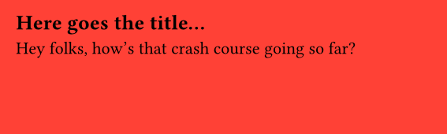

[footnote-1]: https://typst.app/docs/reference/html/ "Note that you can also generate other files such as HTML"

## Basic syntax

If you've ever used Markdown before, getting started with Typst will be easy. For example, the following Typst file:

```typst
= My first Typst document

== Smaller heading

=== But still a heading

This is a paragraph, where text can be *bold*, _italic_, or `code-like`.
```

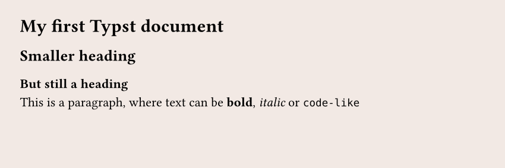

## Functions

Typst offers tons of functions that we can use to customize the output of our PDF. For example, there is a `circle()` function:

```typst
#circle(fill: blue, width: 3cm)
```

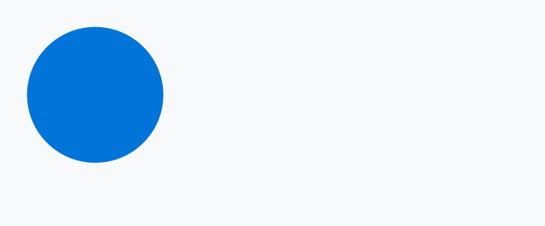

We can, for example, add some text **inside** the circle:

```typst
#circle(fill: blue, width: 3cm, "Hello world")
```

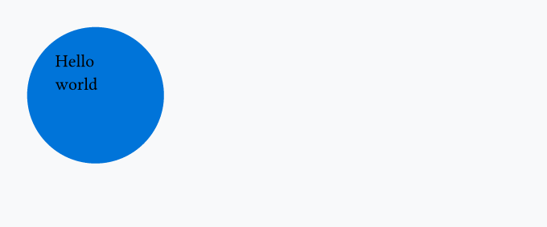

Or another circle:

```typst
#circle(fill: blue, width: 3cm, circle(fill: red, width: 1cm))
```

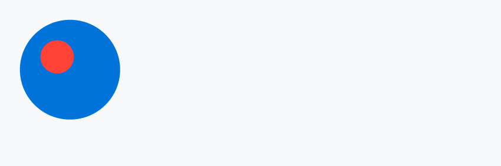

The `circle()` function is useful for creating **visual elements**, but many functions are here to control the **layout of our document**. For example, I want to put a blue circle next to a green rectangle, next to red text. How can I do that?

The simplest way to do it is to use the `stack()` function: it will stack elements (as many as we want) in a given direction.

```typst
#stack(
  dir: ltr, // direction --> left to right
  spacing: 0.5cm, // space between elements
  circle(fill: blue, width: 2cm),
  rect(fill: green, width: 3cm),
  text(fill: red, "Hello")
)
```

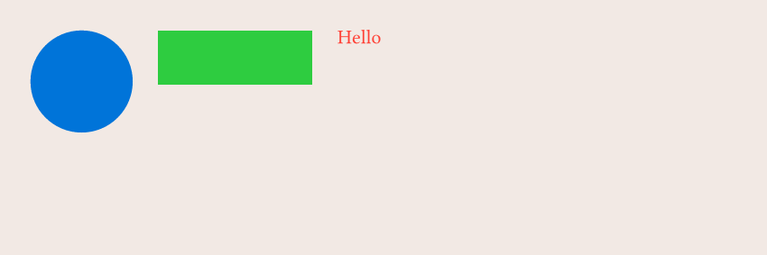

What if I want them to be vertically aligned? We wrap everything in the `align()` function and specify that we align to the `horizon` (could also be `top` or `bottom`):

```typst
#align(horizon, stack(
  dir: ltr,
  spacing: 0.5cm,
  circle(fill: blue, width: 2cm),
  rect(fill: green, width: 3cm),
  text(fill: red, "Hello"),
))
```

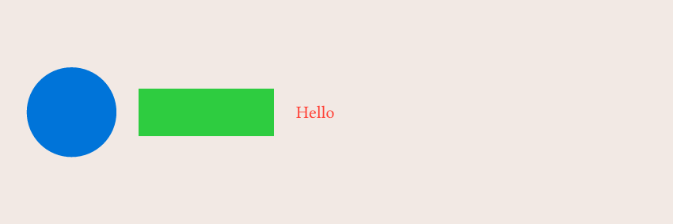

## Set rules

A set rule is a way to tell Typst how a given function should behave. For example, by default the `text()` function uses `fill: black` for its color, but if we do:

```typst
#set text(fill: blue)

= Title

Content of the document
```

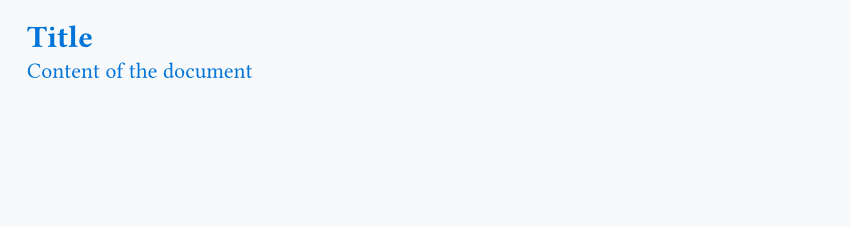

## Variables

We can define variables, like in any programming language, in order to reuse them thanks to the `let` keyword. A common use case is to define branding colors:

```typst
#let yellow = rgb("#FFC300")
#let purple = rgb("#421173")

#set page(fill: yellow)

#align(horizon, stack(
  dir: ltr,
  spacing: 0.5cm,
  circle(fill: purple, width: 2cm),
  rect(fill: purple, width: 3cm, circle(fill: yellow, width: 1cm)),
))
```

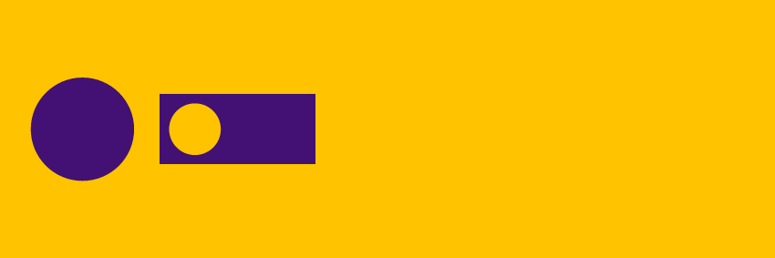

## When and when not to use the `#` symbol

One thing that might be confusing in the previous code snippets is that sometimes we use the `#` symbol, and sometimes we don't.

=== "With the `#`"

    ```typst
    #circle(fill: blue, width: 3cm)
    ```

    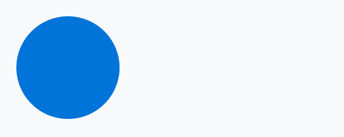

=== "Without the `#`"

    ```typst
    circle(fill: blue, width: 3cm)
    ```

    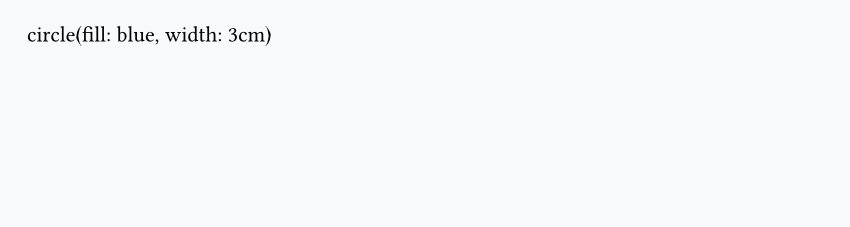

=== "Without the `#`"

    ```typst
    #align(right, circle(fill: blue, width: 3cm))
    ```

    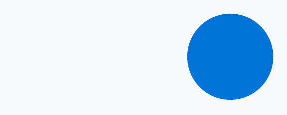

=== "With the `#`"

    ```typst
    #align(right)[#circle(fill: blue, width: 3cm)]
    ```

    

In the first case, the output is just a simple circle, while in the second case, it's the actual text instead of a circle. Why is that?

It's because Typst has [2 modes][footnote-2]:

[footnote-2]: https://typst.app/docs/reference/syntax/ "There are actually 3 modes, where the 3rd one is the math mode, but it's not discussed here."

- Markup mode
- Code mode

By default we're in Markup mode, and we need to add the `#` before a function name, a set rule or when defining a new variable. But we switch to code mode in many cases:

=== "Inside function definition"

    ```typst
    #let yellow-circle() = {
      let yellow = rgb("#FFC300")      // no `#` here
      circle(fill: yellow, width: 3cm) // no `#` here
    }
    ```

=== "Inside function calls"

    ```typst
    #circle(
      width: 3cm,
      circle(fill: blue, width: 1cm) // no `#` here
    )
    ```

Those are just common examples, but in practice **you'll quickly find this intuitive** as you start using Typst. A great way to make this simpler for you is to enable ^^syntax highlighting^^ in your editor. If you have a second look [here](#when-or-when-not-to-use-the--symbol), you'll see that in the second case the text is all black, meaning that it will be rendered as is.
