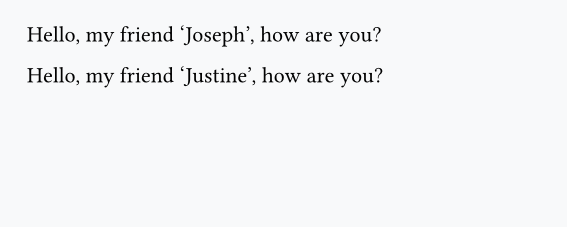
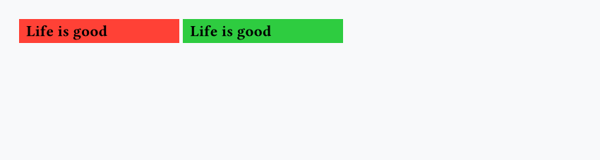
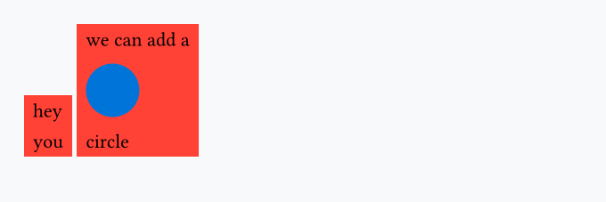
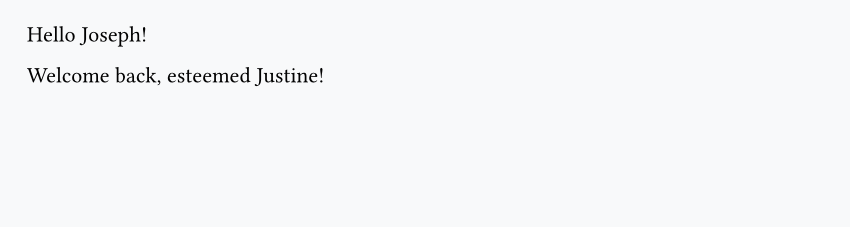
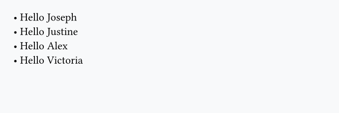

## Create your own functions

Even though Typst is a markup language (!= a programming language), it embeds a scripting language that lets us add **logic** (`if`/`else` statements, `for` loops, etc.) and create reusable components/functions.

Let's look at an example:

```typst
#let say-hello(s) = {
  [Hello, my friend '#s', how are you?]
}

#say-hello("Joseph")

#say-hello("Justine")
```



Once again we use the `let` keyword, and then we wrap the output of the function inside curly braces.

!!! note

    There is no `return` keyword in Typst: everything in your function will be rendered.

## Functions with default arguments

Functions can have as many arguments as we want, and some of them can have default values:

```typst
#let custom-box(label, fill: red) = {
   box(fill: fill, width: 4cm, inset: 5pt, text(weight: "bold", label))
}

#custom-box("Life is good")
#custom-box("Life is good", fill: green)
```



## Variadic arguments

You can make your function accept any number of arguments by using variadic arguments:

```typst
#let custom-stack(..args) = {
  box(fill: red, inset: 5pt, stack(
      dir: ttb,
      spacing: 10pt,
      ..args
   ))
}

#custom-stack("hey", "you")
#custom-stack("we can add a", circle(fill: blue), "circle")
```



We can still apply changes to each argument passed. For example, let's add a black border around each of them:

```typst hl_lines="5"
#let custom-stack(..args) = {
  box(fill: red, inset: 5pt, stack(
    dir: ttb,
    spacing: 10pt,
    ..args.pos().map(val => box(stroke: 0.5pt + black, val)),
  ))
}

#custom-stack("hey", "you")
#custom-stack("we can add a", circle(fill: blue), "circle")
```


The `pos()` method converts it to an array, and `map()` applies a function to each element (`val` becomes `box(stroke: 0.5pt + black, val)`).

## `if`/`else`

You can use `if`/`else` statements, which, for example, can be useful for creating flexible functions:

```typst
#let greet(name, vip: false) = {
  if vip {
    [Welcome back, esteemed #name!]
  } else {
    [Hello #name!]
  }
}

#greet("Joseph")

#greet("Justine", vip: true)
```



## `for` loops

You can use `for` loops to repeat content or iterate over a list:

```typst
#let name-list(names) = {
  for name in names {
    [• Hello #name \ ]
  }
}

#name-list(("Joseph", "Justine", "Alex", "Victoria"))
```


