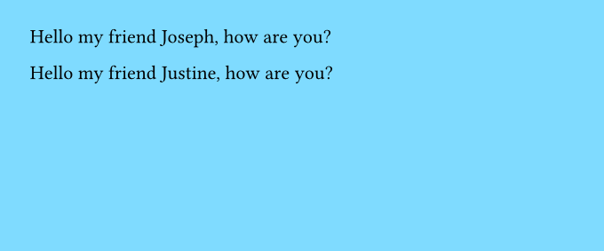
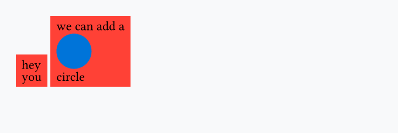

## Create your own functions

Even though Typst is a markup language (!= a programming language), it embeds a scripting language that lets us add **logic** (`if`/`else` statements, `for` loops, etc.) and create reusable components/functions.

Let's look at an example:

```typst
#set page(fill: aqua)

#let say-hello(s) = {
  [Hello my friend #s, how are you?]
}

#say-hello("Joseph")

#say-hello("Justine")
```



Once again we use the `let` keyword, and then we wrap the output of the function inside curly braces.

## Functions with default arguments

Functions can have as many arguments as we want and let some of them have default value:

```typst
#let custom-box(label, fill: red) = {
   box(fill: fill, width: 4cm, inset: 5pt, text(weight: "bold", label))
}

#custom-box("Life is good")
#custom-box("Life is good", fill: green)
```


## Variadic arguments

You can make your function to accept any kind of arguments using variadic arguments:

```typst
#let custom-stack(..args) = {
  box(fill: red, inset: 5pt, stack(
      dir: ttb,
      spacing: 3pt,
      ..args
   ))
}

#custom-stack("hey", "you")
#custom-stack("we can add a", circle(fill: blue), "circle")
```


