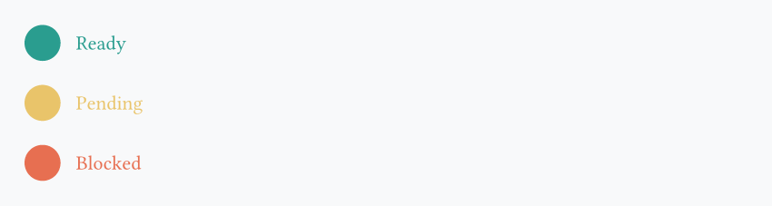
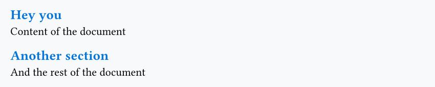
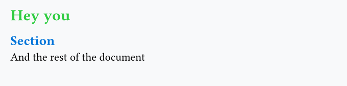
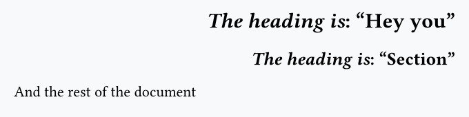
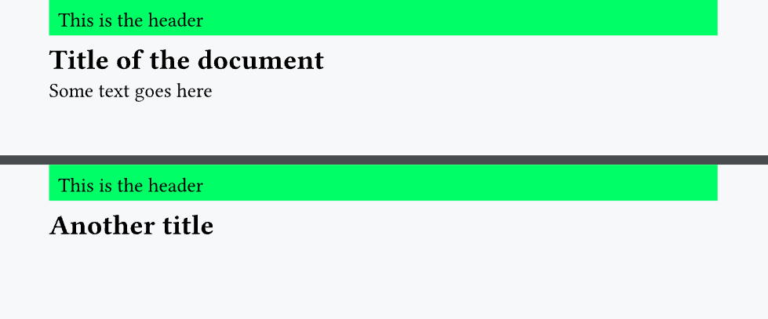
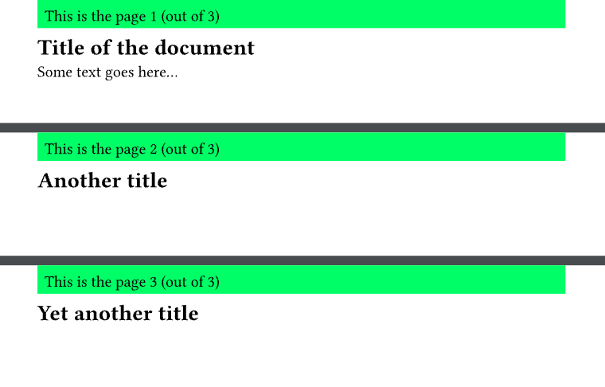

## Components

Components **aren't** a Typst concept, but they're probably a good way to think about functions and, more generally, about development. For example, let's look at this code:

```typst
#align(horizon, stack(
  dir: ltr,
  spacing: 0.3cm,
  circle(fill: rgb("#2a9d8f"), width: 0.7cm),
  text(fill: rgb("#2a9d8f"), "Ready"),
))

#align(horizon, stack(
  dir: ltr,
  spacing: 0.3cm,
  circle(fill: rgb("#e9c46a"), width: 0.7cm),
  text(fill: rgb("#e9c46a"), "Pending"),
))

#align(horizon, stack(
  dir: ltr,
  spacing: 0.3cm,
  circle(fill: rgb("#e76f51"), width: 0.7cm),
  text(fill: rgb("#e76f51"), "Blocked"),
))
```


The code is highly duplicated! Only the label and the color are changing in each element. Instead, what we want to do is:

```typst
#let custom-component(lab, col) = {
  align(horizon, stack(
      dir: ltr,
      spacing: 0.3cm,
      circle(fill: col, width: 0.7cm),
      text(fill: col, lab)
   ))
}

#custom-component("Ready", rgb("#2a9d8f"))
#custom-component("Pending", rgb("#e9c46a"))
#custom-component("Blocked", rgb("#e76f51"))
```



This makes our code:

- **highly reusable**: we can call the `custom-component` function many other times
- **easier to maintain**: change the function definition to update all of its uses

Typst is really well-designed for this component mindset, and it's a good idea to use it from the beginning.

## set and show rules

Our previous example could also be made using set rules (which we already saw in the first lesson). As a reminder, a set rule defines the default behavior of a function. For example, if I write:

```typst
#set circle(width: 1cm)
```

Then, by default, all circles will have a width of 1cm. If we take our example from before:

```typst
#set stack(dir: ltr, spacing: 0.3cm)
#set circle(width: 0.7cm)

#align(horizon, stack(
  circle(fill: rgb("#2a9d8f")),
  text(fill: rgb("#2a9d8f"), "Ready"),
))

#align(horizon, stack(
  circle(fill: rgb("#e9c46a")),
  text(fill: rgb("#e9c46a"), "Pending"),
))

#align(horizon, stack(
  circle(fill: rgb("#e76f51")),
  text(fill: rgb("#e76f51"), "Blocked"),
))
```


Typst also has a more advanced version of set rules called **show rules**. Basically, show rules let us define what happens when a function is called. Let's see an example:

```typst
#show heading: set text(fill: blue)

== Hey you
Content of the document

== Another section
And the rest of the document
```



Here, our show rules say: when adding a heading, set the text to blue by default. Very practical! But what if we want to apply a different color depending on the heading level?

```typst
#show heading.where(level: 1): set text(fill: green)
#show heading.where(level: 2): set text(fill: blue)

= Hey you
== Section
And the rest of the document
```



But we can even go much further with show rules! For example:

```typst
#show heading: it => align(right)[
  #text(weight: "bold", [_The heading is_: "#it.body" (level: #it.level)])
]

= Hey you
== Section
And the rest of the document
```



In short: we can do whatever we want! Here, `it` represents our heading:

- `it.body`: the content
- `it.level`: the heading level
- `it.*`: this works for [all other arguments](https://typst.app/docs/reference/model/heading/) in the heading function (and for all functions too)!

Show rules differ from set rules by the fact that they don't just control default arguments of a function, but **how that function will behave** when called, which is an extremely powerful mechanism.

## Header and footer

One thing where Typst shines is minimizing code duplication: it's very rare that you **need** to write the same code twice, and it's often a symptom that your code should be refactored.

A good example is adding a header or footer to a Typst document.

!!! note

    Since headers and footers behave exactly the same in Typst, we'll only showcase how to create a **header** here.

```typst
#set page(margin: 1cm, header: {
  rect(fill: lime, height: 1cm, width: 100%, "This is the header")
})

= Title of the document
Some text goes here...

#pagebreak() // forces a new page

= Another title
```



Thanks to set rules, we can easily set the default header for all pages.

## Context

An important thing in Typst is the [`context`](https://typst.app/docs/reference/context/). It is a keyword that can give us information about the _current_ context. For example:

- what is the page number of the current page?
- what is the language of the document?
- what is the text color?
- And much more!

The main use case for `context` is adding the page number to the header or footer:

```typst
#set page(
  margin: 1cm,
  height: 3cm,
  width: 15cm,
  header: {
    rect(
      fill: lime,
      height: 1cm,
      width: 100%,
      [#context [This is the page #here().page() (out of #counter(page).final().at(0))]],
    )
  },
)

= Title of the document
Some text goes here...

= Another title

= Yet another title
```



Let's summarize the key parts here:

- Everything is wrapped in `#context []`. This is required; otherwise, the next function calls won't work.
- `#here().page()` gives us the current page number (either 1, 2 or 3).
- `#counter(page).final().at(0)` gives the total number of pages in the entire document (always 3).

!!! info

    `context` can do even more complex things (such as [counting the number of headings before its call](https://typst.app/docs/reference/introspection/here/)), but this will not be detailed here as this concerns relatively few users.
