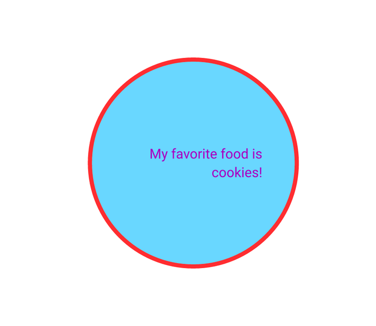

!!! tip

      Make sure to check the overview of [how and why Typst can be used from R](./index.md) to fully understand it.

In R, the recommended binding to use is [r2typ](https://github.com/y-sunflower/r2typ), maintained by the same maintainer as Typst in Production (e.g., the website you're currently on).

Please also note that R integrates well with [Quarto](https://quarto.org/), which offers a convenient and highly customizable way to create reports with Typst. You can find a dedicated tutorial [here](/../quarto/index.md). Also note that `r2typ` has Quarto features too; it's not one or the other.

## Installation

```R
# install.packages("pak")
pak::pkg_install("y-sunflower/r2typ")
```

!!! info

      The installation might take a few minutes because it needs to be built from source, including the Rust backend, which requires compilation.

## Usage

`r2typ` mainly does one thing: generate text from R.

```R
library(r2typ)

heading(level = 2, numbering = "1.1", "Hello world")
#> #heading(level: 2, numbering: "1.1")[Hello world]

text(size = pt(12), baseline = em(1.2), overhang = FALSE, "hey there")
#> #text(size: 12pt, baseline: 1.2em, overhang: false)[hey there]

image(width = percent(80), height = auto, "link.svg")
#> #image(width: 80%, height: auto, "link.svg")

circle(fill = blue, "hey")
#> #circle(fill: blue)[hey]

circle(radius = pt(100), "hey", linebreak(), "there")
#> #circle(radius: 100pt)[hey #linebreak() there]

place(top + left, dy = pt(15), square(size = pt(35), fill = red))
#> #place(top + left, dy: 15pt)[#square(size: 35pt, fill: red)]
```

Pretty much all Typst functions, colors, directions, etc., are supported here.

You can also use `r2typ` to compile your Typst like this:

```R
c(
  set_page(height = pt(400)),
  set_text(purple),
  set_circle(width = percent(50)),
  align(
    center + horizon,
    circle(
      fill = aqua,
      stroke = pt(5) + red,
      align(
        right,
        text(
          font = "Roboto",
          size = em(1.2),
          "My favorite food is cookies!"
        )
      )
    )
  )
) |>
  typst_write() |>
  typst_compile(output = "example.pdf")
```



## Other resources

- [`typr`](https://github.com/christopherkenny/typr/): R package to render Typst documents from R. The same feature is present in `r2typ`, but it does use bindings to the Typst library and requires you to install either the Typst CLI or Quarto (which bundles Typst).

```R
library(typr)

doc <- c(
  "#set page(height: 2cm, width: 10cm)",
  "= Yet another document",
  "With some text"
)

typr_compile(doc, output_format = "png")
```

<br>

!!! question

      Know of other projects that would be a good fit here? Feel free to [open an issue](https://github.com/y-sunflower/typst-in-production/issues).
