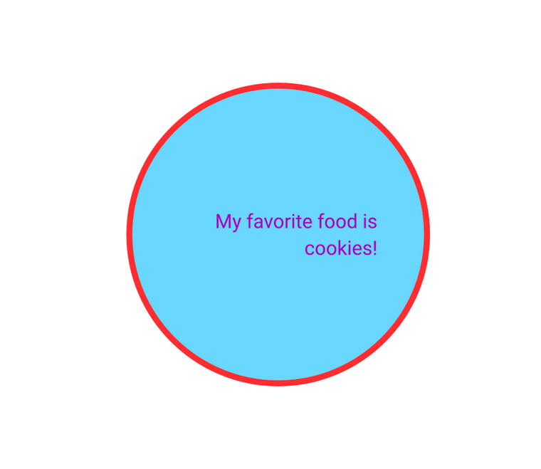

!!! tip

      Make sure to check the overview of [how and why Typst can be used from R](./index.md) to fully understand it.

In R, the recommended binding to use is [tynding](https://github.com/y-sunflower/tynding), maintained by the same maintainer as Typst in Production (that is, the website you're currently on). Another project that we'll show here is [r2typ](https://github.com/y-sunflower/r2typ), which lets you generate Typst with R.

Please also note that R integrates well with [Quarto](https://quarto.org/), which offers a convenient and highly customizable way to create reports with Typst. You can find a dedicated tutorial [here](/../quarto/index.md).

## Installation

```R
# install.packages("pak")
pak::pak("y-sunflower/tynding")
pak::pak("y-sunflower/r2typ")
```

!!! info

      The installation of `tynding` might take a few minutes because it needs to be built from source, including the Rust backend, which requires compilation.

## Usage: `r2typ`

```R
library(r2typ)

heading(level = 2, numbering = "1.1", "Hello world")
#> #heading(level: 2, numbering: "1.1")[Hello world]

text_(size = pt_(12), baseline = em(1.2), overhang = FALSE, "hey there")
#> #text(size: 12pt, baseline: 1.2em, overhang: false)[hey there]

image_(width = percent(80), height = auto, "link.svg")
#> #image(width: 80%, height: auto, "link.svg")

circle(radius = pt_(100), "hey", linebreak(), "there")
#> #circle(radius: 100pt)[hey #linebreak() there]

place(top + left, dy = pt_(15), square(size = pt_(35), fill = red))
#> #place(top + left, dy: 15pt)[#square(size: 35pt, fill: red)]
```

Pretty much all Typst functions, colors, directions, etc., are supported here.

## Usage: `tynding`

```R
library(tynding)

markup <- c(
  '#set document(title: "hello from tynding")',
  "= hello world",
  "this document was compiled from R."
)

typ_file <- typst_write(markup)
pdf_file <- typst_compile(typ_file)
```

## Combining `r2typ` and `tynding`

When used in combination, `r2typ` and `tynding` let you create a PDF with just R!

```R
library(r2typ)
library(tynding)

c(
  set_page(height = pt_(400)),
  set_text(purple),
  set_circle(width = percent(50)),
  align(
    center + horizon,
    circle(
      fill = aqua,
      stroke = pt_(5) + red,
      align(
        right,
        text_(
          font = "Roboto",
          size = em(1.2),
          "My favorite food is cookies!"
        )
      )
    )
  )
) |>
  typst_write() |>
  typst_compile(output = "example.pdf")
```



## Other resources

- [`typr`](https://github.com/christopherkenny/typr/): R package to render Typst documents from R. The same feature is present in `tynding`, but it does **not** use bindings to the Typst library and requires you to install either the Typst CLI or Quarto (which bundles Typst).

```R
library(typr)

doc <- c(
  "#set page(height: 2cm, width: 10cm)",
  "= Yet another document",
  "With some text"
)

typr_compile(doc, output_format = "png")
```

<br>

!!! question

      Know of other projects that would be a good fit here? Feel free to [open an issue](https://github.com/y-sunflower/typst-in-production/issues).
