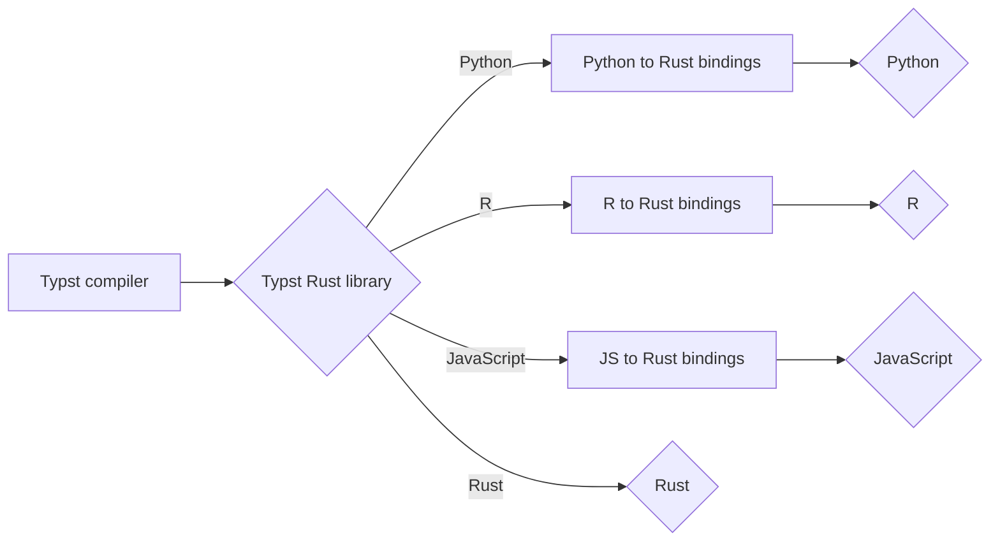

In many cases, you'll want to use Typst in a specific workflow, which often means using a programming language. Whether it's [Python](/from/python.md), [Rust](/from/rust.md), [JavaScript](/from/javascript.md) or [R](/from/R.md), Typst **will** work seamlessly.

## Bindings

In software, **bindings** are the "glue" that let code written in one programming language be used from another language.

They expose functions, classes, or libraries from one language/runtime to another by handling things like:

- Type conversion (e.g., Rust types ↔ Python objects)
- Memory management
- Calling conventions
- Error handling translation

### Example: Rust + Python with `maturin`

`maturin` helps you create **Python bindings for Rust code**.

What happens conceptually:

1. You write performance-critical logic in **Rust**.
2. You **expose** selected Rust functions using a binding layer (commonly via `pyo3`).
3. `maturin` builds a Python **extension module** from that Rust code.
4. Python can then import and use it like a normal module.

So instead of rewriting performance-sensitive code in Python, you:

- Keep speed in Rust
- Access it from Python via bindings

### Simple Conceptual Example

Rust:

```rust
#[pyfunction]
fn add(a: i32, b: i32) -> i32 {
    a + b
}
```

After building with `maturin`, Python can do:

```python
import mymodule
mymodule.add(2, 3)
```

Here, the binding layer:

- Converts Python integers :octicons-arrow-right-24: Rust `i32`
- Calls the Rust function
- Converts the result back :octicons-arrow-right-24: Python integer

### Why bindings exist

- Performance (C/C++/Rust libraries used in Python, Ruby, etc.)
- Reusing existing libraries
- Accessing system-level APIs
- Interoperability between ecosystems

### Typst bindings

In the context of Typst, this is very useful because it lets us use our current logic to define the output report.

Since Typst is built using Rust, we can easily find bindings for many programming languages. In particular, since Typst can be used as a Rust library, people can use that library and build on top of it. Right now, the simplest way to use Typst in Rust is via the [`typst-as-lib`](https://crates.io/crates/typst-as-lib) library, which is a community-made tool.

This means that **all** bindings rely on the Typst library (e.g., Rust) to use Typst, no matter the programming language.



This also means that using Typst from Rust is **more "native"** than in other programming languages since it does not require bindings. You can learn about that in the [Typst from Rust post](/from/rust.md), or choose your favorite programming language:

- [Typst from Python](/from/python.md)
- [Typst from R](/from/R.md)
- [Typst from JavaScript](/from/javascript.md)
- [Typst from Rust](/from/rust.md)
