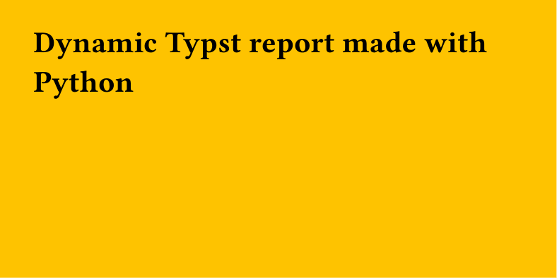

Here is an example that creates a FastAPI `/report` endpoint with a `color` argument that returns a PDF report made with Typst, relying on that parameter for styling.

## Dependencies

Let's start by setting up our environment with [uv](https://docs.astral.sh/uv/):

```
uv init
uv add "fastapi[standard]"
uv add typst
```

## Typst template

First, we create a basic Typst file that will serve as a template:

```typst title="template.typ"
#let col = json(bytes(sys.inputs.color))
#set page(fill: rgb(col), width: 10cm, height: 5cm)

= Dynamic Typst report made with Python
```

## FastAPI endpoint

Then we create a minimalist FastAPI app with a single `/report` endpoint:

```python title="main.py"
from pathlib import Path
import json

from fastapi import FastAPI
from fastapi.responses import FileResponse
import typst

app = FastAPI()

@app.get("/report")
def report(color: str):
    path_typst = "template.typ"
    path_pdf = "report.pdf"

    sys_inputs = {"color": json.dumps(color)}

    typst.compile(
        path_typst,
        output=path_pdf,
        sys_inputs=sys_inputs,
    )

    return FileResponse(Path(path_pdf))
```

This endpoint has a `color` parameter that will be passed to the Typst template.

## Run the server

Then we can try it with:

```
uv run uvicorn main:app --reload
```

And in another process:

```
curl "http://127.0.0.1:8000/report?color=FFC300" --output report.pdf
```

This will save a `report.pdf` file that looks like this (yellow background because of the `#FFC300` color):



<br>

!!! tip

      If you want to learn more about Python and Typst, check out [the dedicated tutorial](../from/python.md).
