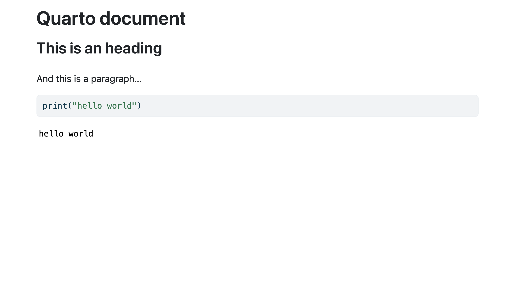
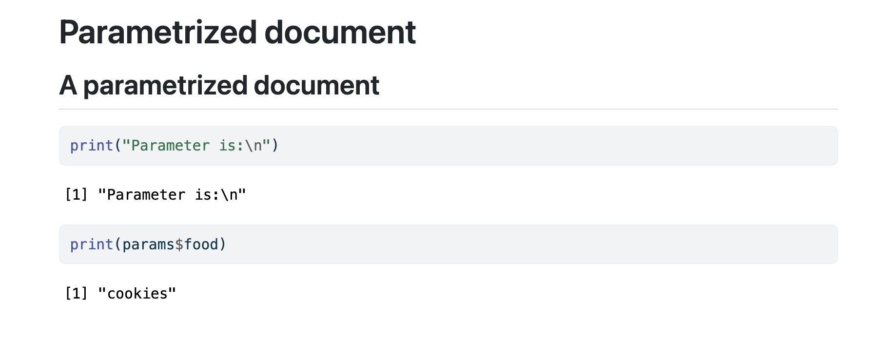

Quarto is an authoring system that lets you define document content in one place. In practice, you create a `.qmd` file that combines Markdown and code chunks (R, Python, Julia, or Observable).

````md
---
title: Quarto document
format: html
---

## This is a heading

And this is a paragraph...

```{python}
print("hello world")
```
````

You can then use the Quarto CLI to render this file to an HTML document:

```bash
quarto render file.qmd
```

This command creates `file.html`:



## Core features

Quarto is especially useful for three main reasons:

=== "Export formats"

    Write once in a single source format (Markdown + code), then export to multiple output formats (HTML, PDF, Word, Markdown).

    

=== "Parameters"

    Quarto documents can be parameterized. For example, your file can define a parameter (such as a country) and reuse it in code. This lets you maintain one document and render many variants (for example, one per country).

    ````md
    ---
    title: Parameterized document
    params:
      food: cookies
    ---

    ## A parameterized document

    ```{r}
    print("Parameter is:\n")
    print(params$food)
    ```
    ````

    

=== "Other"

    Quarto also provides extensive support for styling, templates, extensions, and interactivity. Its community is large and active. To explore more, visit the [official website](https://quarto.org/).

## Python, R, and Julia

Quarto is commonly used with Python, R, and Julia. Usage can differ slightly by language, especially when working with Typst. Learn more here:

- [Quarto and Python](python.md)
- [Quarto and R](R.md)
- [Quarto and Julia](julia.md)
